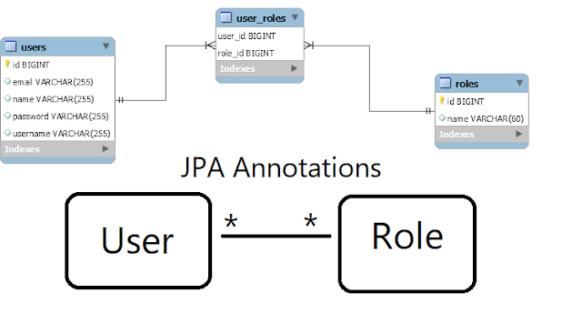

# Spring Boot User Registration and Login Example Tutorial

[参考资料](https://www.javaguides.net/2018/10/user-registration-module-using-springboot-springmvc-springsecurity-hibernate5-thymeleaf-mysql.html)
[代码仓](https://github.com/RameshMF/registration-login-springboot-security-thymeleaf/blob/master/src/main/java/com/example/registrationlogindemo/service/impl/UserServiceImpl.java)

## 技术栈

- Spring Boot 3
- Spring MVC 6
- Spring Security 6
- Hibernate 6
- Thymeleaf 3
- MySQL 8
- Maven

We validate the user registration fields with Java bean validation annotations with Hibernate validator implementation.

Basically, we will develop a simple User Registration Module using Role-based Spring Security which can use in any
spring MVC-based project.

## 数据库结构

